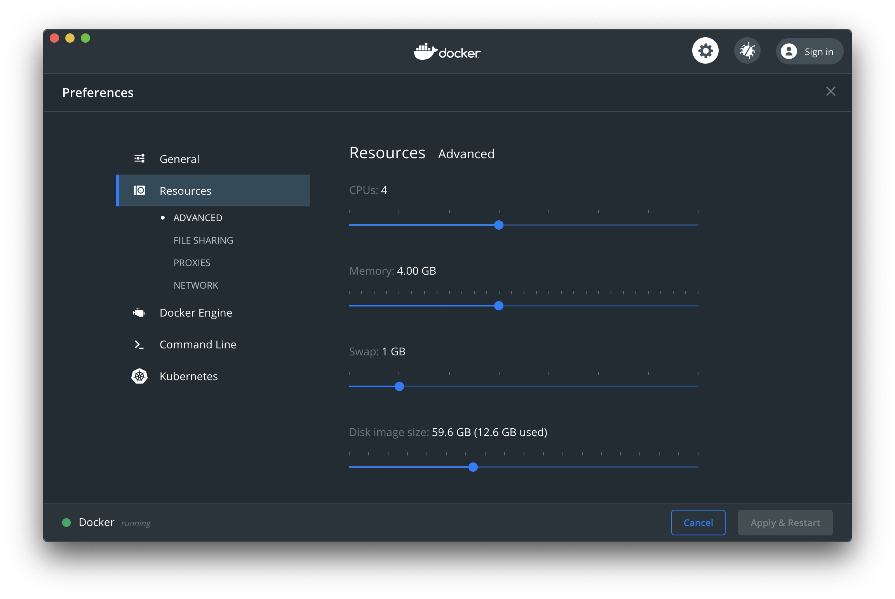

# COVID19 Data Sets and Visualization

## Inspiration
We needed a data pipeline to demonstrate the functionality of  kafka and elasticsearch and proper data science workflows

## Prerequisites
* Set up and install Docker
* Open [COVID 19 Lab](./COVID19.md) to run a local Covid19 Data science workbench

Note: if you are running Docker Desktop, allocate at least 3 GB for memory and 4 CPUs.


1. Right click on Docker Desktop icon
1. Select Preferences
1. Select Resources
1. Set CPUs = 4
1. Set Memory to at least 4GB
1. Press the Apply & Restart button to make the changes.
* Download the kafka connectors 
* see [ReadMe](./README.md) if you are facing any challenges

## Turn on docker if you have not done so already

```
docker-compose up --force-recreate -V --remove-orphans --always-recreate-deps
```

#### open another terminal and push in COVID19 Data
```
curl -X POST -H 'Accept: application/json'    -H 'Content-Type: application/json'   http://localhost:8083/connectors -d @connector-configs/climaterest.json
```

#### Run the python data cleaner

Follow instructions below

1. open another terminal and Run the code to clean the data

```
docker run --rm -ti   --network cassandra-kafka-elasticsearch-open-source_default   -v `pwd`:/usr/src/app   jfloff/alpine-python:3.7-slim     -A /usr/src/app/apk-requirements.txt     -B /usr/src/app/build-requirements.txt     -r /usr/src/app/requirements.txt     -- python3 /usr/src/app/climate_datacleaner.py
```

2. open another terminal and Validate that you have cleaned the data successfully
```
docker exec -it cassandra-kafka-elasticsearch-open-source_connect_1 bash -c   "kafka-console-consumer --bootstrap-server kafka:9092   --topic climateclean  --from-beginning"
```

#### open another terminal and Send the data to elastic search
```
curl -X POST -H 'Accept: application/json'    -H 'Content-Type: application/json'   http://localhost:8083/connectors -d @connector-configs/climateelk.json
```

#### open another terminal and Validate elasticsearch has ingested the data

```
curl -X GET -H 'Content-Type: application/json' 'http://localhost:9200/climate/_search?size=1000&pretty'
```

## Do some data exploration with kibana
1. [Navigate to Kibana](http://localhost:5601/app/kibana#/management/kibana/index_pattern?_g=())

## (OPTIONAL) setting up the python environment locally

**if you want to run the python locally, below are the instructions otherwise skip to 2**

```
pip3 install kafka-python
pip3 install snappy
brew install snappy
pip3 install python-snappy
```


