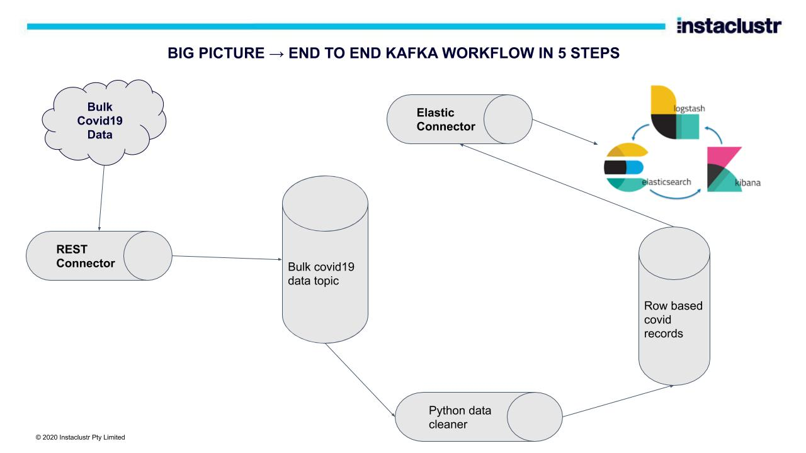

# Open Source Big Data Workbench

This open source project is to provide a solid foundation on building a data pipeline end to end using purely open source technology with zero licensed solutions, you can use this in your own learning and incorporate into your data science workflows.

Our motivation was to empower you with creating big data workflows from beginning to end.

## Requirements
* Install python3 on your workstation 
* Install Docker on your workstation

Note: if you are running Docker Desktop, allocate at least 3 GB for memory and 4 CPUs.


1. Right click on Docker Desktop icon
1. Select Preferences
1. Select Resources
1. Set CPUs = 4
1. Set Memory to at least 4GB
1. Press the Apply & Restart button to make the changes.

## Set up the environment

* Set up and install Docker
* Download the kafka connectors 


```
  mkdir jars
  cd jars/
  curl -L -O https://cassandra-kafka-elasticsearch-open-source.s3-us-west-1.amazonaws.com/kafka-connect-rest-plugin-1.0.3-shaded.jar
  curl -L -O https://cassandra-kafka-elasticsearch-open-source.s3-us-west-1.amazonaws.com/kafka-connect-transform-add-headers-1.0.3-shaded.jar
  curl -L -O https://cassandra-kafka-elasticsearch-open-source.s3-us-west-1.amazonaws.com/kafka-connect-transform-from-json-plugin-1.0.3-shaded.jar
  curl -L -O https://cassandra-kafka-elasticsearch-open-source.s3-us-west-1.amazonaws.com/kafka-connect-transform-velocity-eval-1.0.3-shaded.jar
  curl -L -O https://cassandra-kafka-elasticsearch-open-source.s3-us-west-1.amazonaws.com/kafka-connect-elastic6-1.2.3-2.1.0-all.jar
  curl -L -O https://cassandra-kafka-elasticsearch-open-source.s3-us-west-1.amazonaws.com/kafka-connect-cassandra-1.2.3-2.1.0-all.jar
  cd ..
```

## Deploy the docker environment

1. docker-compose up --force-recreate -V

## Lab Exercises

* Open [COVID 19 Lab](./COVID19.md) to run a local Covid19 Data science workbench


* Open [Cassandra world Clock](./CASSANDRA.md)


