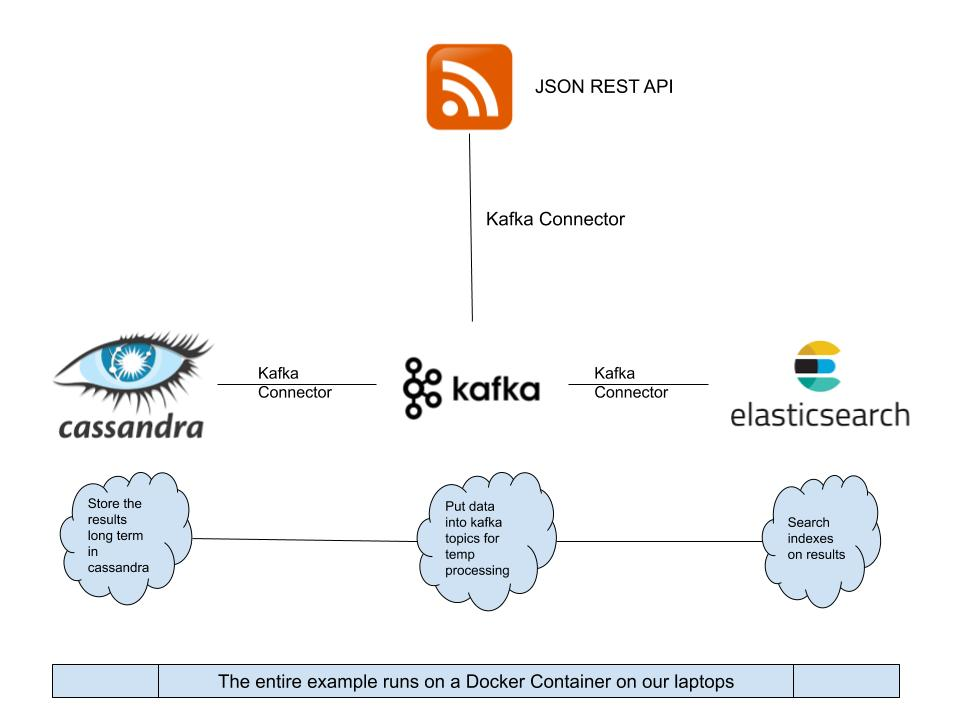
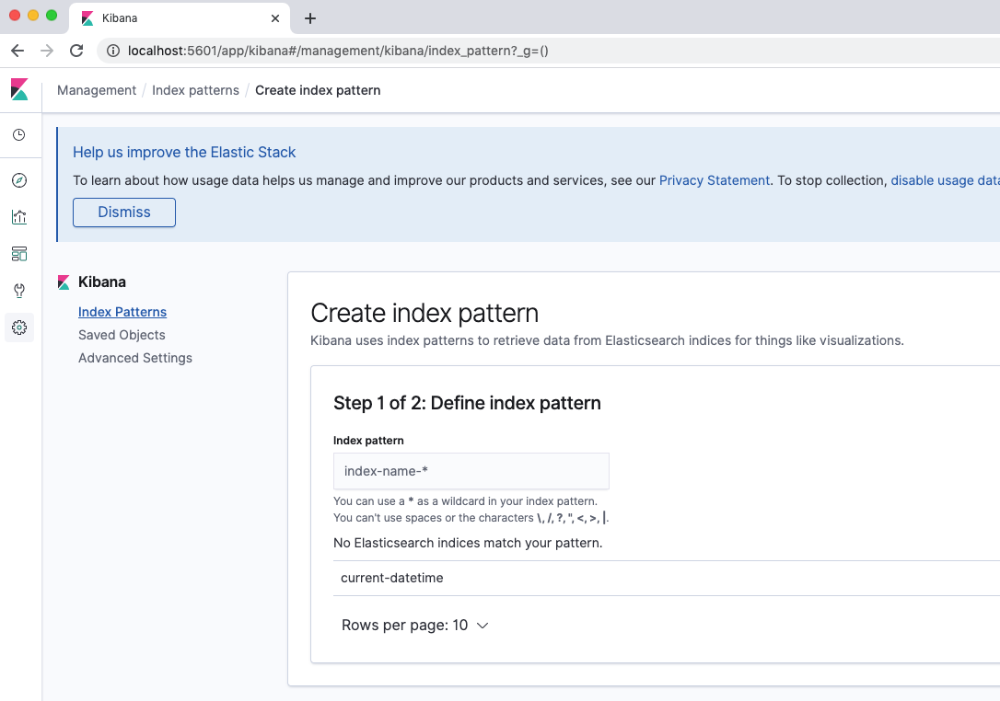
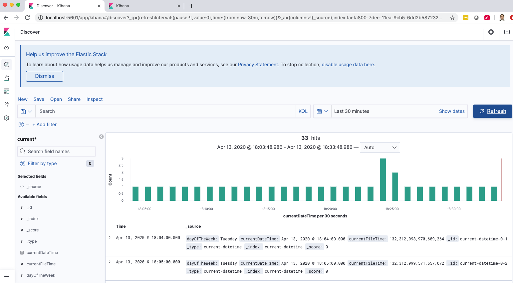

# cassandra-kafka-elasticsearch-open-source
a open source project to demonstrate a data pipeline from REST API all the way to elasticsearch through kafka connectors and some kind of data manipulation

## Inspiration
We needed a data pipeline to demonstrate the functionality of cassandra / kafka / elasticsearch

## Pre-requisites
* Set up and install Docker
* Download the kafka connectors 

	```
	mkdir jars
	cd jars/
	wget https://cassandra-kafka-elasticsearch-open-source.s3-us-west-1.amazonaws.com/kafka-connect-rest-plugin-1.0.3-shaded.jar
	wget https://cassandra-kafka-elasticsearch-open-source.s3-us-west-1.amazonaws.com/kafka-connect-transform-add-headers-1.0.3-shaded.jar
	wget https://cassandra-kafka-elasticsearch-open-source.s3-us-west-1.amazonaws.com/kafka-connect-transform-from-json-plugin-1.0.3-shaded.jar
	wget https://cassandra-kafka-elasticsearch-open-source.s3-us-west-1.amazonaws.com/kafka-connect-transform-velocity-eval-1.0.3-shaded.jar
	wget https://cassandra-kafka-elasticsearch-open-source.s3-us-west-1.amazonaws.com/kafka-connect-elastic6-1.2.3-2.1.0-all.jar
	wget https://cassandra-kafka-elasticsearch-open-source.s3-us-west-1.amazonaws.com/kafka-connect-cassandra-1.2.3-2.1.0-all.jar
	cd ..
	```

  or try curl if wget does not work

```
  mkdir jars
  cd jars/
  curl -L -O https://cassandra-kafka-elasticsearch-open-source.s3-us-west-1.amazonaws.com/kafka-connect-rest-plugin-1.0.3-shaded.jar
  curl -L -O https://cassandra-kafka-elasticsearch-open-source.s3-us-west-1.amazonaws.com/kafka-connect-transform-add-headers-1.0.3-shaded.jar
  curl -L -O https://cassandra-kafka-elasticsearch-open-source.s3-us-west-1.amazonaws.com/kafka-connect-transform-from-json-plugin-1.0.3-shaded.jar
  curl -L -O https://cassandra-kafka-elasticsearch-open-source.s3-us-west-1.amazonaws.com/kafka-connect-transform-velocity-eval-1.0.3-shaded.jar
  curl -L -O https://cassandra-kafka-elasticsearch-open-source.s3-us-west-1.amazonaws.com/kafka-connect-elastic6-1.2.3-2.1.0-all.jar
  curl -L -O https://cassandra-kafka-elasticsearch-open-source.s3-us-west-1.amazonaws.com/kafka-connect-cassandra-1.2.3-2.1.0-all.jar
  cd ..
```

## Deploy the docker environment

1. docker-compose up --force-recreate -V

## Open another terminal and Enable the connectors 
```
curl -X POST -H 'Accept: application/json'    -H 'Content-Type: application/json'   http://localhost:8083/connectors -d @connector-configs/current-datetime.json
curl -X POST -H 'Accept: application/json'    -H 'Content-Type: application/json'   http://localhost:8083/connectors -d @connector-configs/utcelk.json
curl -X POST -H 'Accept: application/json'    -H 'Content-Type: application/json'   http://localhost:8083/connectors -d @connector-configs/utccassandra.json
```

## Open another terminal to validate the connectors
verify the rest connector is ingesting data 
```
docker exec -it cassandra-kafka-elasticsearch-open-source_connect_1 bash -c   "kafka-console-consumer --bootstrap-server kafka:9092   --topic current-datetime --from-beginning"
```

#### Validate elasticsearch has ingested the data
* input

	`curl http://127.0.0.1:9200/current-datetime/_search/?size=1000&pretty=1`

* validate

*Check the console*
`{"took":8,"timed_out":false,"_shards":{"total":1,"successful":1,"skipped":0,"failed":0},"hits":{"total":{"value":29,"relation":"eq"},"max_score":1.0,"hits":[{"_index":"current-datetime","_type":"current-datetime","_id":"current-datetime-0-0","_score":1.0,"_source":{"dayOfTheWeek":"Tuesday","currentDateTime":"2020-04-14T01:03Z","currentFileTime":132312998369757549}},{"_index":"current-datetime","_type":"current-datetime","_id":"current-datetime-0-1","_score":1.0,"_source":{"dayOfTheWeek":"Tuesday","currentDateTime":"2020-04-14T01:04Z","currentFileTime":132312998970689266}},{"_index":"current-datetime","_type":"current-datetime","_id":"current-datetime-0-2","_score":1.0,"_source":{"dayOfTheWeek":"Tuesday","currentDateTime":"2020-04-14T01:05Z","currentFileTime":132312999571657054}},{"_index":"current-datetime","_type":"current-datetime","_id":"current-datetime-0-3","_score":1.0,"_source":{"dayOfTheWeek":"Tuesday","currentDateTime":"2020-04-14T01:06Z","currentFileTime":132313000172654285}},{"_index":"current-datetime","_type":"current-datetime","_id":"current-datetime-0-4","_score":1.0,"_source":{"dayOfTheWeek":"Tuesday","currentDateTime":"2020-04-14T01:07Z","currentFileTime":132313000773434479}},{"_index":"current-datetime","_type":"current-datetime","_id":"current-datetime-0-5","_score":1.0,"_source":{"dayOfTheWeek":"Tuesday","currentDateTime":"2020-04-14T01:08Z","currentFileTime":132313001374382632}},{"_index":"current-datetime","_type":"current-datetime","_id":"current-datetime-0-6","_score":1.0,"_source":{"dayOfTheWeek":"Tuesday","currentDateTime":"2020-04-14T01:09Z","currentFileTime":132313001975291264}},{"_index":"current-datetime","_type":"current-datetime","_id":"current-datetime-0-7","_score":1.0,"_source":{"dayOfTheWeek":"Tuesday","currentDateTime":"2020-04-14T01:10Z","currentFileTime":132313002576201685}},{"_index":"current-datetime","_type":"current-datetime","_id":"current-datetime-0-8","_score":1.0,"_source":{"dayOfTheWeek":"Tuesday","currentDateTime":"2020-04-14T01:11Z","currentFileTime":132313003177159014}},{"_index":"current-datetime","_type":"current-datetime","_id":"current-datetime-0-9","_score":1.0,"_source":{"dayOfTheWeek":"Tuesday","currentDateTime":"2020-04-14T01:12Z","currentFileTime":132313003778899192}},{"_index":"current-datetime","_type":"current-datetime","_id":"current-datetime-0-10","_score":1.0,"_source":{"dayOfTheWeek":"Tuesday","currentDateTime":"2020-04-14T01:13Z","currentFileTime":132313004379766982}},{"_index":"current-datetime","_type":"current-datetime","_id":"current-datetime-0-11","_score":1.0,"_source":{"dayOfTheWeek":"Tuesday","currentDateTime":"2020-04-14T01:14Z","currentFileTime":132313004981127254}},{"_index":"current-datetime","_type":"current-datetime","_id":"current-datetime-0-12","_score":1.0,"_source":{"dayOfTheWeek":"Tuesday","currentDateTime":"2020-04-14T01:15Z","currentFileTime":132313005582092368}},{"_index":"current-datetime","_type":"current-datetime","_id":"current-datetime-0-13","_score":1.0,"_source":{"dayOfTheWeek":"Tuesday","currentDateTime":"2020-04-14T01:16Z","currentFileTime":132313006185439058}},{"_index":"current-datetime","_type":"current-datetime","_id":"current-datetime-0-14","_score":1.0,"_source":{"dayOfTheWeek":"Tuesday","currentDateTime":"2020-04-14T01:17Z","currentFileTime":132313006786489144}},{"_index":"current-datetime","_type":"current-datetime","_id":"current-datetime-0-15","_score":1.0,"_source":{"dayOfTheWeek":"Tuesday","currentDateTime":"2020-04-14T01:18Z","currentFileTime":132313007387657248}},{"_index":"current-datetime","_type":"current-datetime","_id":"current-datetime-0-16","_score":1.0,"_source":{"dayOfTheWeek":"Tuesday","currentDateTime":"2020-04-14T01:19Z","currentFileTime":132313007988489710}},{"_index":"current-datetime","_type":"current-datetime","_id":"current-datetime-0-17","_score":1.0,"_source":{"dayOfTheWeek":"Tuesday","currentDateTime":"2020-04-14T01:20Z","currentFileTime":132313008589424111}},{"_index":"current-datetime","_type":"current-datetime","_id":"current-datetime-0-18","_score":1.0,"_source":{"dayOfTheWeek":"Tuesday","currentDateTime":"2020-04-14T01:21Z","currentFileTime":132313009190359663}},{"_index":"current-datetime","_type":"current-datetime","_id":"current-datetime-0-19","_score":1.0,"_source":{"dayOfTheWeek":"Tuesday","currentDateTime":"2020-04-14T01:22Z","currentFileTime":132313009792017971}},{"_index":"current-datetime","_type":"current-datetime","_id":"current-datetime-0-20","_score":1.0,"_source":{"dayOfTheWeek":"Tuesday","currentDateTime":"2020-04-14T01:23Z","currentFileTime":132313010393116357}},{"_index":"current-datetime","_type":"current-datetime","_id":"current-datetime-0-21","_score":1.0,"_source":{"dayOfTheWeek":"Tuesday","currentDateTime":"2020-04-14T01:24Z","currentFileTime":132313010786904293}},{"_index":"current-datetime","_type":"current-datetime","_id":"current-datetime-0-22","_score":1.0,"_source":{"dayOfTheWeek":"Tuesday","currentDateTime":"2020-04-14T01:24Z","currentFileTime":132313010856907901}},{"_index":"current-datetime","_type":"current-datetime","_id":"current-datetime-0-23","_score":1.0,"_source":{"dayOfTheWeek":"Tuesday","currentDateTime":"2020-04-14T01:24Z","currentFileTime":132313010994111901}},{"_index":"current-datetime","_type":"current-datetime","_id":"current-datetime-0-24","_score":1.0,"_source":{"dayOfTheWeek":"Tuesday","currentDateTime":"2020-04-14T01:25Z","currentFileTime":132313011387885900}},{"_index":"current-datetime","_type":"current-datetime","_id":"current-datetime-0-25","_score":1.0,"_source":{"dayOfTheWeek":"Tuesday","currentDateTime":"2020-04-14T01:25Z","currentFileTime":132313011457896107}},{"_index":"current-datetime","_type":"current-datetime","_id":"current-datetime-0-26","_score":1.0,"_source":{"dayOfTheWeek":"Tuesday","currentDateTime":"2020-04-14T01:26Z","currentFileTime":132313012058690674}},{"_index":"current-datetime","_type":"current-datetime","_id":"current-datetime-0-27","_score":1.0,"_source":{"dayOfTheWeek":"Tuesday","currentDateTime":"2020-04-14T01:27Z","currentFileTime":132313012659520109}},{"_index":"current-datetime","_type":"current-datetime","_id":"current-datetime-0-28","_score":1.0,"_source":{"dayOfTheWeek":"Tuesday","currentDateTime":"2020-04-14T01:28Z","currentFileTime":132313013260366976}}]}}`
#### Validate Cassandra has ingested the data
* input
```
docker exec -it cassandra-kafka-elasticsearch-open-source_cassandra_1 bash

select * from test.clock;
```
* validate

 currentfiletime    | currentdatetime   | dayoftheweek
--------------------+-------------------+--------------
 132312998369757549 | 2020-04-14T01:03Z |      Tuesday
 132312999571657054 | 2020-04-14T01:05Z |      Tuesday
 132312998970689266 | 2020-04-14T01:04Z |      Tuesday


## Understanding Data Flows - Time Clock syncing



#### Kafka REST Connector
look at the configuration for the rest connector [link to connector source code](https://github.com/llofberg/kafka-connect-rest)

rest connector creates its own topic

```
{
    "name": "source_rest_current-datetime",
    "config": {
      "key.converter":"org.apache.kafka.connect.storage.StringConverter",
      "value.converter":"org.apache.kafka.connect.storage.StringConverter",
      "connector.class": "com.tm.kafka.connect.rest.RestSourceConnector",
      "tasks.max": "1",
      "rest.source.poll.interval.ms": "60000",
      "rest.source.method": "GET",
      "rest.source.url": "http://worldclockapi.com/api/json/utc/now",
      "rest.source.headers": "Content-Type:application/json,Accept:application/json",
      "rest.source.topic.selector": "com.tm.kafka.connect.rest.selector.SimpleTopicSelector",
      "rest.source.destination.topics": "current-datetime"
    }
}
```

#### Kafka ElasticSearch Connector
look at the configuration for the elk connector
[link to connector source code](https://github.com/lensesio/stream-reactor/tree/master/kafka-connect-elastic6)

```
{
	"name": "elk",
	"config":{
		"connector.class":"com.datamountaineer.streamreactor.connect.elastic6.ElasticSinkConnector",
		"tasks.max":"1",
		"topics":"current-datetime",
		"connect.elastic.url":"elasticsearch:9200",
		"connect.elastic.use.http":"http",
		"connect.elastic.kcql":"INSERT INTO current-datetime SELECT dayOfTheWeek,currentDateTime,currentFileTime FROM current-datetime",
		"connect.progress.enabled":"true"
	}
}
```

#### Kafka Cassandra Connector
* look at the configuration for the cassandra connector
[link to connector source code](https://github.com/lensesio/stream-reactor/tree/master/kafka-connect-cassandra)

    ```
{
  "name": "utccassandra",
  "config": {
    "tasks.max": "1",
    "connector.class": "com.datamountaineer.streamreactor.connect.cassandra.sink.CassandraSinkConnector",
    "connect.cassandra.contact.points":"cassandra",
    "connect.cassandra.port":"9042",
    "connect.cassandra.consistency.level": "LOCAL_ONE",
    "connect.cassandra.key.space": "test",
    "connect.cassandra.kcql": "INSERT INTO clock SELECT dayOfTheWeek,currentDateTime,currentFileTime FROM current-datetime",
    "topics": "current-datetime"
  }
}
```

* look at the boot up process for cassandra

    ```
cat >/import.cql <<EOF
DROP keyspace test;
CREATE keyspace test with replication = {'class':'SimpleStrategy', 'replication_factor' : 1} AND durable_writes = true;
CREATE TABLE test.clock ( 
	dayOfTheWeek text,
	currentDateTime text,
	currentFileTime timestamp,
	PRIMARY KEY (currentFileTime)
);
EOF
```

* look at docker compose 
    
    ```
      cassandra:
    image: cassandra:3.0.20
    volumes:
      - "./cassandra-init.sh:/cassandra-init.sh"
    command: "sh /cassandra-init.sh"
    ports:
      - "9042:9042"
    links:
      - connect
    ```

# You may add some other conditionals that fits your stuation here
until cqlsh -f /import.cql; do
  echo "cqlsh: Cassandra is unavailable to initialize - will retry later"
  sleep 2
done &

exec /docker-entrypoint.sh "$@"
```
  * docker-compose program entry
```
  cassandra:
    image: cassandra:3.0.20
    volumes:
      - "./cassandra-init.sh:/cassandra-init.sh"
    command: "sh /cassandra-init.sh"
    ports:
      - "9042:9042"
    links:
      - connect
```
## Do some data exploration with kibana
1. [Navigate to Kibana](http://localhost:5601/app/kibana#/management/kibana/index_pattern?_g=())



